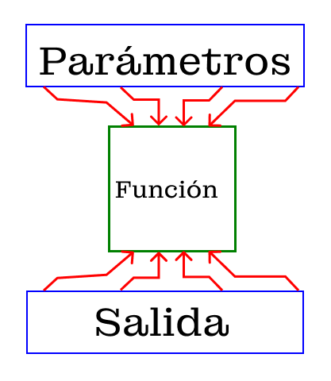
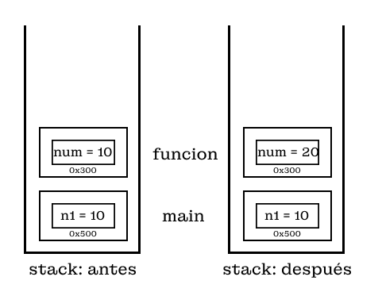
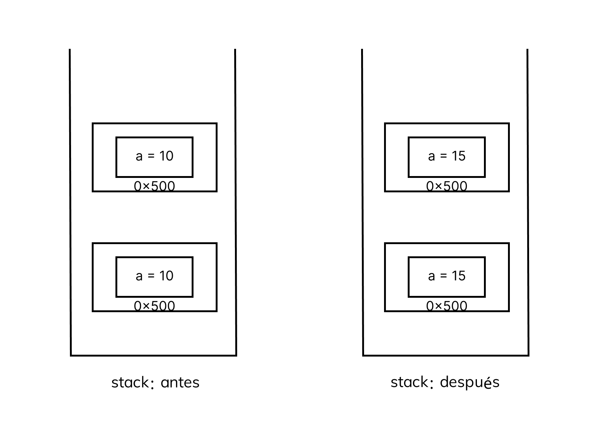

# Funciones y Alcance de las Variables
- [Funciones y Alcance de las Variables](#funciones-y-alcance-de-las-variables)
  - [Funciones](#funciones)
    - [Definición](#definición)
    - [Utilidades de las funciones](#utilidades-de-las-funciones)
      - [Modularización](#modularización)
      - [Evitar repeticiones del mismo código](#evitar-repeticiones-del-mismo-código)
      - [Abstracción o Encapsulamiento](#abstracción-o-encapsulamiento)
    - [Declaración de una función](#declaración-de-una-función)
    - [Parametros de las funciones](#parametros-de-las-funciones)
      - [Valores por defecto](#valores-por-defecto)
    - [Sobrecargar de funciones](#sobrecargar-de-funciones)
    - [Parámetros variables](#parámetros-variables)
    - [Funciones miembro y globales](#funciones-miembro-y-globales)
  - [Alcance de las variables](#alcance-de-las-variables)
    - [Pasar datos por valor](#pasar-datos-por-valor)
    - [Paso por referencia](#paso-por-referencia)

## Funciones
### Definición 
Las funciones son de las funcionaliades más importantes de cualquier lenguaje
de programación, este es un conjunto de sentencias que toman entradas,
realizan una operación en específico y nos producen una salida. Podemos,
tener ninguna, una o varias entradas, y de igual forma, ninguna, una o varias salidas.



### Utilidades de las funciones

- Modalarización del código
- Evitar repeticiones del mismo código
- Abstracción o encapsulamiento de las operaciones

#### Modularización

La modularización del código en un programa, es de suma importancia, este nos permite
digamos, de cierta manera ejecutar partes del código en un lado distinto o
en archivos distintos; supongamos que tenemos el siguiente código, y para poder resolver
cada 1 de los problemas hemos hecho uso de 100 líneas.

```CPP
#include <iostream>

int main(){
    // Lectura de los datos
    // Resolución del primer problema
    // Resolución del segundo problema
    // Resolución del tercer problema
    // Resolución del cuarto problema
    // Resolución del quinto problema
    ....
    // Resolución del N-ésimo problema
}
```

Si hicieramos todo el proceso el `main()`, este tendría `100N` líneas de códigos
el poder mantener cada uno de esos problemas, encontra `bugs`, o si cambiarón las 
condiciónes de cierto problema sería extremedamente difícil de poder realizar los cambios necesarios
para que funciones.

Lo correcto sería realizar lo siguiente:

```CPP
#include <iostream>
// Resolución del primer problema
// Resolución del segundo problema
// Resolución del tercer problema
// Resolución del cuarto problema
// Resolución del quinto problema
....
// Resolución del N-ésimo problema
int main(){
    // Lectura de los datos
    // primerProblema()
    // segundoProblema()
    // tercerProblema()
    ...
    // NesimoProblema()
}
```

Al realizar la llamada de cada de función, esto nos permite saber en que rango de 
líneas de código pertenece el problema, y es más facil el mantenimiento del código.

#### Evitar repeticiones del mismo código

Al momento de realizar un programar, existen ciertas operaciones que vamos a tener
que repetir constatemente, y en distintos momentos; supongamos que tenemos que 
hallar la distancia mínima entre varias variables:

```CPP
#include <iostream>

typedef struct{
    int x;
    int y;
    int z;
}PlanoCartesiano;

int main(){
    PlanoCartesiano a,b,c,d,e,f;
    // DistanciaMinimaEntre A y B
    // DistanciaMinimaEntre B y C
    // DistanciaMinimaEntre C y D
    // DistanciaMinimaEntre E y F
    // DistanciaMinimaEntre F y D
    ...
}
```

El tener que escribir repetidamente el código para poder calcular dicha distancia minima
entre cada una de las variables, seria tedioso; y sería mejor solo tener una única función
que realize el calculo, bajo ciertas restricciones(las variables de entrada). Así, ya solo
escribimos el código 1 sola vez, y solo llamaríamos a la función las veces que sea necesario.
#### Abstracción o Encapsulamiento

El poder encapsular nuestro código, sirve principalmente para que un usuario
no pueda acceder facilmente, un ejemplo de esto es cuando usuamos alguna de las
liberías standar del lenguaje `C/C++`, no conocemos como fueron implementadas,
pero las utilizamos. Ejemplo:

```CPP
#include <iostream>
#include <cmath>

int main(){
    double raiz = sqrt(25);
    double potenia = pow(2,4);
}
```

### Declaración de una función

```CPP
// <tipo de retorno> <nombre de la funcion> (<tipo de variable> <nombre del parametro>){
//     <cuerpo de la funcion>
// }
#include <iostream>

// Se indica el tipo de variable que vamos a retornar
// Se indica la cantidad de parametros que va a recibir la función, y de que tipo son
int suma(int a,int b){
    return a + b; // retorna el valor pedido
}


int main(){
    int x = suma(5,5);
    std::cout << x << "\n";
    return 0;
}
```

Tener en cuenta que se tiene que usar el `return`, para poder retornar el valor
que deseamos; y que las funciones de tipo `void`, no van a retornar ningún valor.

```CPP
void function(int a,int b){
    int suma = a + b;
    std::cout << suma << "\n";
}
```

Las funciones tienen que ser declardas antes de la función donde es llamada, para que esta pueda
ser utilizada; esto se debe a como trabaja el compilador de `C/C++`; primero
lee todo el archivo, y luego va a ejecutando línea por línea de la funcion `main()`.

```CPP

void funcion1(){
    ....
}

void funcion2_1(){
    ....
}

void funcion2(){
    ....
    funcion2_1();
}

int main(){
    ...
    funcion1();
    ...
    funcion2()
    return 0;
}
```

Esto de aquí no es dificil de entender, sino también que tenemos que tener en cuenta
el orden coloquemos la función, ya que si la `funcion1()`, desearía llamar a la `funcion2()`
no podría ya que fue declarado abajo de esta; para poder solucionar esto de aquí,
primero declaramos la cabecera de la función, y debajo de la función `main()`,
realizamo su implementación; así ya no tenemos que preocuparnos por el orden que
tenga la función.

```CPP

void funcion1();
void funcion2();
void funcion2_1();


int main(){
    ...
    funcion1();
    ...
    funcion2();
    ...
    funcion3();
}


void funcion1(){
    ....
}

void funcion3(){
    ...
}

void funcion2(){
    ....
    funcion2_1();
}

void funcion2_1(){
    ....
}
```
Con esto ya tenemos un mejor orden de las cosas, sino también que se puede hacer
llamado a cualquier función, siempre y cuando se declaró su cabecera antes.

<!-- <details>
    <summary> PREGUNTA: ¿La funcion1(), puede llamar a la funcion3()? </summary>
    No, porque su cabecera no fue definida antes y esta está solo antes de la <i>funcion2()</i>
    y <i>funcion2_1()</i>.
</details> -->

### Parametros de las funciones

Existen algunas propiedades, que deberiamos de tener en cuenta al momento de trabajar
con parámetros

#### Valores por defecto

```CPP
#include <iostream>

void imprimeFecha(int dd = 0,int mm = 0,int aaaa = 0);

int main(){
    imprimeFecha(26,2,2023);
    imprimeFecha(26,2);
    imprimeFecha(26);
    return 0;
}

void imprimeFecha(int dd,int mm,int aaaa){
    std::cout << dd << "/"
                << mm << "/"
                << aaaa << "/\n";
}
```

### Sobrecargar de funciones

Esta es una propiedad exclusiva de `C++`, donde podemos declarar multiples funciones
con el mismo *nombre*; para que pueda suceder esto se debe de cumplir una de las siguientes condiciones:

- Distinta cantidad de parámetros
- Tipos de los datos deben de ser distintos

```CPP
int suma(int a, int b){
    return a + b;
}

int suma(int a, int b,int c){
    return a + b + c;
}

int suma(int a, int b,int c,int d){
    return a + b + c + d;
}

int suma(int a, int b,int c,int d,int e){
    return a + b + c + d + e;
}

int main(){
    int s1,s2,s3,s4;
    s1 = suma(4,5);
    s2 = suma(4,5,6);
    s3 = suma(4,5,6,7);
    s4 = suma(4,5,6,7,8);
    std::cout << "S1: " << s1 << "\n"
                << "S2: " << s2 << "\n"
                << "S3: " << s3 << "\n"
                << "S4: " << s4 << "\n";

        return 0;
}
```
> Si bien podemos sobrecargar una función, no se recomienda, ya que cada función
> dede de ser capaz de resolver un único problema, así que se recomendariar usar
> los `namespace`.


### Parámetros variables

Podemos declarar una función que acepte una cantidad variable de parámetros,
tenemos 2 formas:

```CPP
<tipo de retorno> <nombre>(){
    <cuerpo de la funcion>
}

<tipo de retorno> <nombre>(...){
    <cuerpo de la funcion>
}
```

También que acepte una cantidad mínima de parámetros

```CPP
<tipo de retorno> <nombre>(<parametros>, ... ){
    <cuerpo de la funcion>
}
```

El ejemplo más claro de este tipo de funciones es la función `printf`, donde no tenemos
un límite en la cantidad de parámetros que le podemos pasar para que imprima en consola
los valores que deseamos.

Este es un tema extenso y dificil de poder explicar; por lo que dejo
aquí la explicación realizar por mi profesor de la universidad(WaniGod):

- [Funciones con un número de parámetros variables](http://agora.pucp.edu.pe/inf2170681/13.htm)

También es bueno conocer sobre la librería `<stdarg.h>`:

- [Librería *stdarg.h*](http://agora.pucp.edu.pe/inf2170681/)

### Funciones miembro y globales

Las funciones globabales son las que hemos estado trabajando hasta ahorita, donde
se declara las funciones en un archivo *hpp* y su función el procedimiento
que realiza en un archivo *cpp*, de mismo nombre.

Mientras que las funciones miembro son aquellas que se declarán dentro de una misma
estructura o dentro.

```CPP
struct stComplejo{
    double real;
    double imaginario;
    // funcion miembro
    stComplejo operator+(const stComplejo &otro) const{
        stComplejo resultado;
        resultado.real = real + otro.real;
        resultado.imaginario = imaginario + otro.imaginario;
        return resultado;
    }
};
```

Aquí algunas de sus principales diferencias. Tener en cuenta que esto será mucho
más importante para el tema de POO.

| Característica              | Funciones Miembro                                       | Funciones Globales                                          |
| --------------------------- | ------------------------------------------------------- | ----------------------------------------------------------- |
| **Pertenencia a una Clase** | Están asociadas a una clase específica.                 | No están vinculadas a ninguna clase en particular.          |
| **Acceso a Datos de Clase** | Tienen acceso directo a los datos miembro de la clase.  | No tienen acceso directo a los datos miembro de una clase.  |
| **Sintaxis**                | Se definen dentro de la declaración de la clase.        | Se definen fuera de la clase.                               |
| **Contexto de Ejecución**   | Se ejecutan en el contexto de un objeto de la clase.    | Se ejecutan en un contexto global.                          |
| **Encapsulamiento**         | Pueden ser utilizadas para implementar encapsulamiento. | No tienen acceso directo a los datos internos de una clase. |


## Alcance de las variables

[Recordar](https://github.com/JesusHuayhua/CPP-Notes/blob/main/variables.md#espacialidad-de-las-variables)
la espacialidad que tiene cada variable se amplia también a las funciones.

```CPP
void incrementarEn5(int a){
    a += 5;
}

int main(){
    int a = 5;
    incrementarEn5(a);
    std::cout << "a: " << a; // salida => a: 5
    return 0;
}
```

Al ejecutar el anterior código, el valor de la variable `a`, no cambio a `10`.
Esto pasa, porque podemos pasar las `variables` por medio de 2 formas:

- Paso por valor
- Paso por referencia o puntero

### Pasar datos por valor

En este caso solo se pasa el argumento que tiene almacenado la variable, por lo que
no importa que cambio le hagamos en la funcion, la variable no será afectada.
Nos podemos percatar de esto, por la dirección de memoría de la variable

```CPP
void funcion(int num){
    num = 20;
    std::cout << "La Dirección en la función es: " << &num << "\n";
    std::cout << "El valor de la variable en la función es: " << num << "\n";
}

int main(){
    int n1 = 10;
    std::cout << "La Dirección en el main es: " << &n1;
    std::cout << "El valor de la variable en el main es: " << n1 << "\n";
}
```

Lo podemos apreciar mejor con la siguiente imagen:



### Paso por referencia

El paso por referencia, sucede cuando deseamos modificar el valor
de la variable en una función diferente de donde esta fue declarada.

```CPP
void incrementarEn5(int &a){
    std::cout << "La Dirección en la funcion es: " << &a << std::endl;
    a += 5;
}

int main(){
    int a = 5;
    std::cout << "La Dirección en el main es: " << &a << std::endl;
    incrementarEn5(a);
    std::cout << "a: " << a; // salida => a: 10
    return 0;
}
```

Como podemos verificar para pasar parámetros por referencia, estos tiene que estar
precedidos por un `&`.

